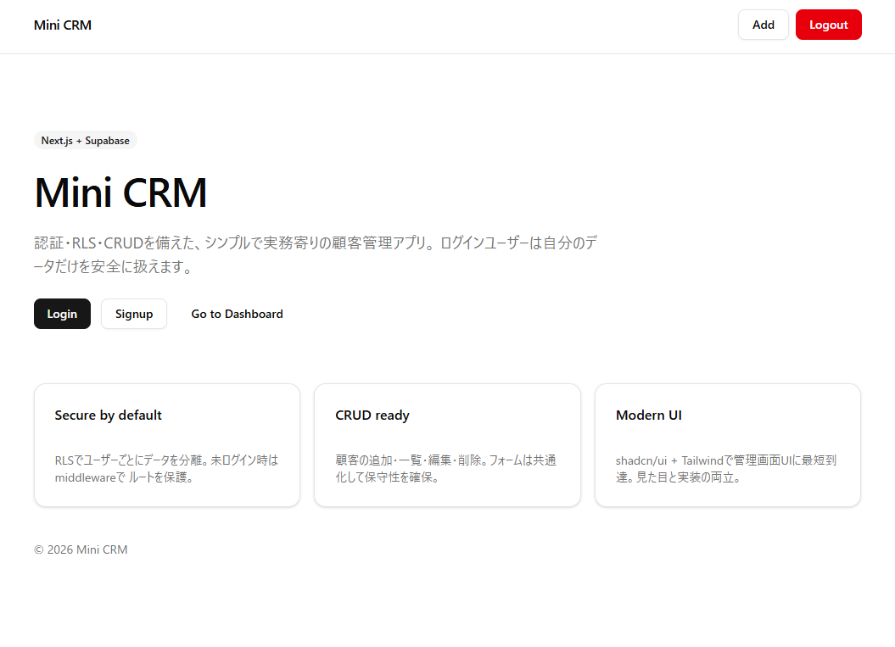
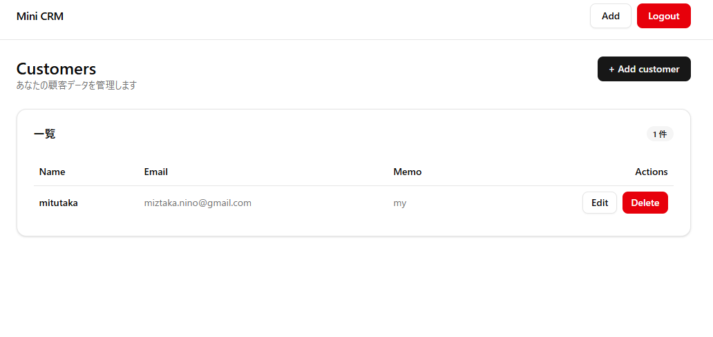
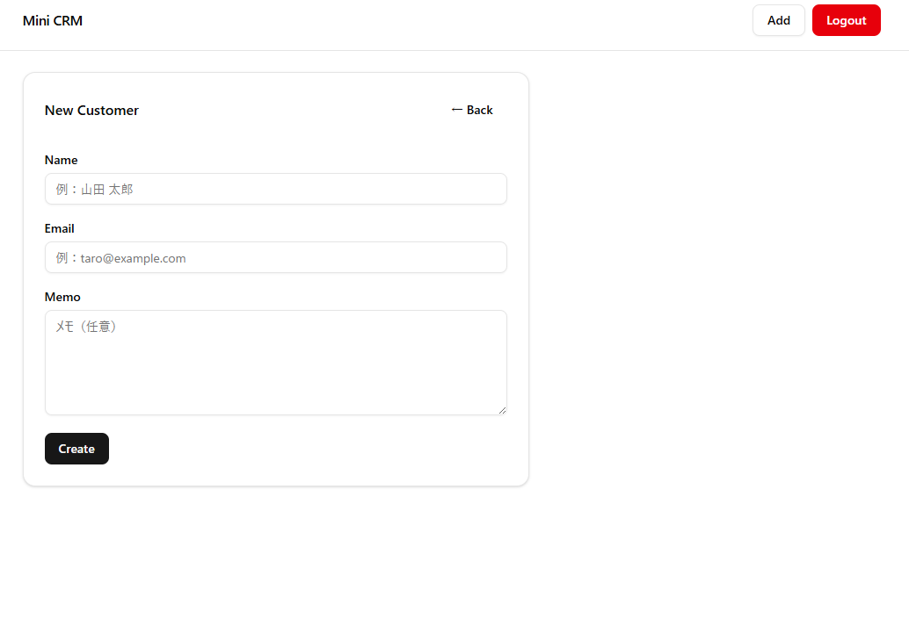

# Mini CRM（Next.js + Supabase）

未経験から「実務で使える管理画面の型」を身につけることを目的に開発した、シンプルな顧客管理（CRM）アプリです。  
**認証・RLS（Row Level Security）・CRUD・ルートガード**を一通り実装し、セキュリティと保守性を重視しています。

このアプリから、**管理画面の基本構成・認証設計・データ分離の考え方**が分かるように設計しています。

## デモ
- Vercel：  https://mini-r9hyyhjij-mitsutakaninomiyas-projects.vercel.app/

## 画面イメージ

### ログイン


### ダッシュボード


### 顧客管理


## 技術スタック
- Next.js（App Router）
- TypeScript
- Tailwind CSS / shadcn/ui
- Supabase（Auth / Postgres / RLS）
- react-hook-form + zod
- Vercel

## 実装機能
- 認証（サインアップ / ログイン / ログアウト）
- middleware によるルートガード（`/dashboard`, `/customers/*`）
- 顧客CRUD（作成 / 一覧 / 編集 / 削除）
  - 項目：name / email / memo
- ユーザーごとのデータ分離（RLS）

## セキュリティ設計
- フロントエンドから `user_id` を送らない設計
  - DB側で `auth.uid()` を使用して所有者を判定
- 未認証ユーザーの操作を2段階で防止
  - UIレベルでの表示制御
  - middleware による `/login` への強制リダイレクト

## 画面イメージ
- ログイン画面
- ダッシュボード
- 顧客一覧 / 新規作成 / 編集

## 詰まった点と解決（学び）
- **RLSエラー**：`new row violates row level security policy`
  - 原因：ログアウト状態で Add / Edit を実行
  - 対策：Header表示制御 + middleware によるアクセス制御
- **Vercelビルドエラー**：`useSearchParams() should be wrapped in a suspense boundary`
  - 対策：`/login` を Server Component と Client Component に分離し、`Suspense` でラップ

## ローカル起動
```bash
npm install
npm run dev


This is a [Next.js](https://nextjs.org) project bootstrapped with [`create-next-app`](https://nextjs.org/docs/app/api-reference/cli/create-next-app).

## Getting Started

First, run the development server:

```bash
npm run dev
# or
yarn dev
# or
pnpm dev
# or
bun dev
```

Open [http://localhost:3000](http://localhost:3000) with your browser to see the result.

You can start editing the page by modifying `app/page.tsx`. The page auto-updates as you edit the file.

This project uses [`next/font`](https://nextjs.org/docs/app/building-your-application/optimizing/fonts) to automatically optimize and load [Geist](https://vercel.com/font), a new font family for Vercel.

## Learn More

To learn more about Next.js, take a look at the following resources:

- [Next.js Documentation](https://nextjs.org/docs) - learn about Next.js features and API.
- [Learn Next.js](https://nextjs.org/learn) - an interactive Next.js tutorial.

You can check out [the Next.js GitHub repository](https://github.com/vercel/next.js) - your feedback and contributions are welcome!

## Deploy on Vercel

The easiest way to deploy your Next.js app is to use the [Vercel Platform](https://vercel.com/new?utm_medium=default-template&filter=next.js&utm_source=create-next-app&utm_campaign=create-next-app-readme) from the creators of Next.js.

Check out our [Next.js deployment documentation](https://nextjs.org/docs/app/building-your-application/deploying) for more details.
